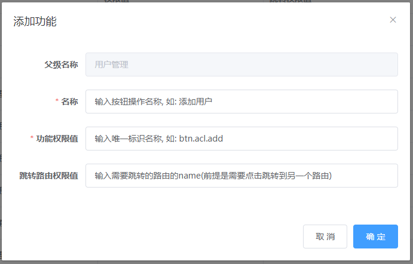
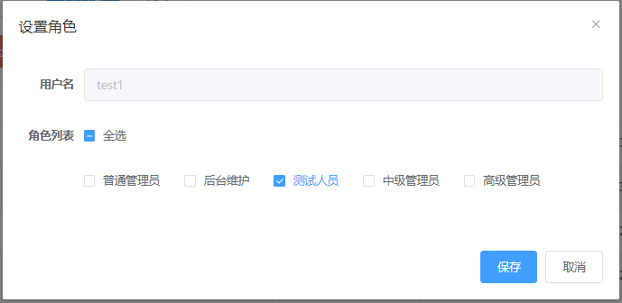

# Vue后台admin--权限管理


> 相关接口文档: http://39.99.186.36:8170/swagger-ui.html


## 登陆 & 自动登陆 & 退出登陆

### vue.config.js

```js
// before: require('./mock/mock-server.js'),
proxy: {
  '/dev-api': { // 匹配所有以 '/dev-api'开头的请求路径
    target: 'http://39.99.186.36',
    changeOrigin: true, // 支持跨域
    pathRewrite: { // 重写路径: 去掉路径中开头的'/dev-api'
      '^/dev-api': ''
    }
  },
}
```


### utils/request.js

```js
config.headers['token'] = getToken()
```


### api/user.js

```js
import request from '@/utils/request'

/* 
登陆
*/
export function login({username, password}) {
  return request({
    url: '/admin/acl/index/login',
    method: 'post',
    data: {username, password}
  })
}

/* 
获取用户信息(根据token)
*/
export function getInfo() {
  return request({
    url: '/admin/acl/index/info',
    method: 'get',
  })
}

/* 
登出
*/
export function logout() {
  return request({
    url: '/admin/acl/index/logout',
    method: 'post'
  })
}
```


### store/modules/user.js

```js
getInfo({ commit }) {
  return new Promise((resolve, reject) => {
    getInfo().then(response => {
     	//...
    }).catch(error => {
      reject(error)
    })
  })
},
```


### views/login/index.vue

```js
const validateUsername = (rule, value, callback) => {
  // 检查长度即可
  if (value.length < 5) {
    callback('用户名长度不能小于5')
  } else {
    callback()
  }
}
const validatePassword = (rule, value, callback) => {
  if (value.length < 6) {
    callback('密码长度不能小于6')
  } else {
    callback()
  }
}
```


## 权限CRUD: API

### api/acl/user.js

```js
import request from '@/utils/request'

const api_name = '/admin/acl/user'

/*
登陆
*/
export function login({ username, password }) {
  return request({
    url: '/admin/acl/index/login',
    method: 'post',
    data: { username, password }
  })
}

/*
获取用户信息(根据token)
*/
export function getInfo() {
  return request({
    url: '/admin/acl/index/info',
    method: 'get'
  })
}

/*
登出
*/
export function logout() {
  return request({
    url: '/admin/acl/index/logout',
    method: 'post'
  })
}

/* 
获取当前用户的菜单权限列表
*/
export function getMenu() {
  return request('/admin/acl/index/menu')
}


/* 
获取后台用户分页列表(带搜索)
*/
export function getPageList(page, limit, searchObj) {
  return request({
    url: `${api_name}/${page}/${limit}`,
    method: 'get',
    params: searchObj
  })
}

/* 
根据ID获取某个后台用户
*/
export function getById(id) {
  return request({
    url: `${api_name}/get/${id}`,
    method: 'get'
  })
}

/* 
保存一个新的后台用户
*/
export function add(user) {
  return request({
    url: `${api_name}/save`,
    method: 'post',
    data: user
  })
}

/* 
更新一个后台用户
*/
export function update(user) {
  return request({
    url: `${api_name}/update`,
    method: 'put',
    data: user
  })
}

/* 
获取某个用户的所有角色
*/
export function getRoles(userId) {
  return request({
    url: `${api_name}/toAssign/${userId}`,
    method: 'get'
  })
}

/* 
给某个用户分配角色
roleId的结构: 字符串, 'rId1,rId2,rId3'
*/
export function assignRoles(userId, roleId) {
  return request({
    url: `${api_name}/doAssign`,
    method: 'post',
    params: {
      userId,
      roleId
    }
  })
}

/* 
删除某个用户
*/
export function removeById(id) {
  return request({
    url: `${api_name}/remove/${id}`,
    method: 'delete'
  })
}

/* 
批量删除多个用户
ids的结构: ids是包含n个id的数组
*/
export function removeUsers(ids) {
  return request({
    url: `${api_name}/batchRemove`,
    method: 'delete',
    data: ids
  })
}

```


### api/acl/role.js

```js
/* 
角色管理相关的API请求函数
*/
import request from '@/utils/request'

const api_name = '/admin/acl/role'

export default {

  /* 
  获取角色分页列表(带搜索)
  */
  getPageList(page, limit, searchObj) {
    return request({
      url: `${api_name}/${page}/${limit}`,
      method: 'get',
      params: searchObj // url查询字符串或表单键值对
    })
  },

  /* 
  获取某个角色
  */
  getById(id) {
    return request({
      url: `${api_name}/get/${id}`,
      method: 'get'
    })
  },

  /* 
  保存一个新角色
  */
  save(role) {
    return request({
      url: `${api_name}/save`,
      method: 'post',
      data: role
    })
  },

  /* 
  更新一个角色
  */
  updateById(role) {
    return request({
      url: `${api_name}/update`,
      method: 'put',
      data: role
    })
  },

  /* 
  获取一个角色的所有权限列表
  */
  getAssign(roleId) {
    return request({
      url: `${api_name}/toAssign/${roleId}`,
      method: 'get'
    })
  },

  /* 
  删除某个角色
  */
  removeById(id) {
    return request({
      url: `${api_name}/remove/${id}`,
      method: 'delete'
    })
  },

  /* 
  批量删除多个角色
  */
  removeRoles(ids) {
    return request({
      url: `${api_name}/batchRemove`,
      method: 'delete',
      data: ids
    })
  }
}
```


### api/acl/permission.js

```js
import request from '@/utils/request'

/* 
权限管理相关的API请求函数
*/
const api_name = '/admin/acl/permission'

export default {
  
  /* 
  获取权限(菜单/功能)列表
  */
  getPermissionList() {
    return request({
      url: `${api_name}`,
      method: 'get'
    })
  },
  
  /* 
  删除一个权限项
  */
  removePermission(id) {
    return request({
      url: `${api_name}/remove/${id}`,
      method: "delete"
    })
  },
  
  /* 
  保存一个权限项
  */
  addPermission(permission) {
    return request({
      url: `${api_name}/save`,
      method: "post",
      data: permission
    })
  },

  /* 
  更新一个权限项
  */
  updatePermission(permission) {
    return request({
      url: `${api_name}/update`,
      method: "put",
      data: permission
    })
  },

  /* 
  查看某个角色的权限列表
  */
  toAssign(roleId) {
    return request({
      url: `${api_name}/toAssign/${roleId}`,
      method: 'get'
    })
  },

  /* 
  给某个角色授权
  */
  doAssign(roleId, permissionId) {
    return request({
      url: `${api_name}/doAssign`,
      method: "post",
      params: {roleId, permissionId}
    })
  }
}

```


### api/acl/index.js

```js
export * as user from './acl/user'
export { default as role } from './acl/role'
export { default as permission } from './acl/permission'
```


### main.js

```js
import * as API from '@/api'

Vue.prototype.$API = API
```


## 权限CRUD: 组件

### components/HintButton/index.vue

```js
<template>
  <el-tooltip :content="title" placement="top-start">
    <el-button v-bind="$attrs" v-on="$listeners"/>
  </el-tooltip>
</template>

<script type="text/ecmascript-6">

  export default {
    name: 'HintButton',
    props: {
      title: String
    },

    mounted () {
      // console.log('mounted()', this.$attrs)
      // console.log('mounted()', this.$listeners)
    }
  }
</script>


// 注意在入口JS中注册成全局组件
Vue.component(HintButton.name, HintButton)
```


### views/acl/user/list.vue

```js
<template>
  <div class="app-container">
    <el-form inline>
      <el-form-item>
         <el-input v-model="tempSearchObj.username" placeholder="用户名" />
      </el-form-item>

      <el-button type="primary" icon="el-icon-search" @click="search">查询</el-button>
      <el-button type="default" @click="resetSearch">清空</el-button>
    </el-form>

    <div style="margin-bottom: 20px">
      <el-button type="primary" @click="showAddUser">添 加</el-button>
      <el-button type="danger" @click="revomveUsers" :disabled="selectedIds.length===0">批量删除</el-button>
    </div>

    <el-table
      border
      stripe
      v-loading="listLoading"
      :data="users"
      @selection-change="handleSelectionChange">

      <el-table-column
        type="selection"
        width="55" />

      <el-table-column
        type="index"
        label="序号"
        width="80"
        align="center"
      />

      <el-table-column prop="username" label="用户名" width="150" />
      <el-table-column prop="nickName" label="用户昵称" />
      <el-table-column prop="roleName" label="权限列表" />
      
      <el-table-column prop="gmtCreate" label="创建时间" width="180"/>
      <el-table-column prop="gmtModified" label="更新时间" width="180"/>

      <el-table-column label="操作" width="230" align="center">
        <template slot-scope="{row}">
          <HintButton type="info" size="mini" icon="el-icon-user-solid" title="分配角色"
            @click="showAssignRole(row)"/>
          <HintButton type="primary" size="mini" icon="el-icon-edit" title="修改用户"
            @click="showUpdateUser(row)"/>
          <el-popconfirm :title="`确定删除 ${row.username} 吗?`" @onConfirm="removeUser(row.id)">
            <HintButton style="margin-left:10px" slot="reference" type="danger" size="mini" icon="el-icon-delete" title="删除用户"/> 
          </el-popconfirm>
        </template>
      </el-table-column>
    </el-table>

    <el-pagination
      :current-page="page"
      :total="total"
      :page-size="limit"
      :page-sizes="[5, 10, 20, 30, 40, 50, 100]"
      style="padding: 20px 0;"
      layout="prev, pager, next, jumper, ->, sizes, total"
      @current-change="getUsers"
      @size-change="handleSizeChange"
    />

    <el-dialog :title="user.id ? '修改用户' : '添加用户'" :visible.sync="dialogUserVisible">
      <el-form ref="userForm" :model="user" :rules="userRules" label-width="120px">
        <el-form-item label="用户名" prop="username">
          <el-input v-model="user.username"/>
        </el-form-item>
        <el-form-item label="用户昵称">
          <el-input v-model="user.nickName"/>
        </el-form-item>
        
        <el-form-item v-if="!user.id" label="用户密码" prop="password">
          <el-input v-model="user.password"/>
        </el-form-item>
      </el-form>
      <div slot="footer" class="dialog-footer">
        <el-button @click="cancel">取 消</el-button>
        <el-button :loading="loading" type="primary" @click="addOrUpdate">确 定</el-button>
      </div>
    </el-dialog>

    <el-dialog title="设置角色" :visible.sync="dialogRoleVisible" :before-close="resetRoleData">
      <el-form label-width="80px">
        <el-form-item label="用户名">
          <el-input disabled :value="user.username"></el-input>
        </el-form-item>

        <el-form-item label="角色列表">
          <el-checkbox :indeterminate="isIndeterminate" v-model="checkAll" @change="handleCheckAllChange">全选</el-checkbox>
          <div style="margin: 15px 0;"></div>
          <el-checkbox-group v-model="userRoleIds" @change="handleCheckedChange">
            <el-checkbox v-for="role in allRoles" :key="role.id" :label="role.id">{{role.roleName}}</el-checkbox>
          </el-checkbox-group>
        </el-form-item>
      </el-form>

      <div slot="footer">
        <el-button :loading="loading" type="primary" @click="assignRole">保存</el-button>
        <el-button @click="resetRoleData">取消</el-button>
      </div>
    </el-dialog>
  </div>
</template>

<script>
import cloneDeep from 'lodash/cloneDeep'

export default {
  name: 'AclUserList',

  data () {
    return {
      listLoading: false, // 是否显示列表加载的提示
      searchObj: { // 包含请求搜索条件数据的对象
        username: ''
      },
      tempSearchObj: { // 收集搜索条件输入的对象
        username: ''
      },
      selectedIds: [], // 所有选择的user的id的数组
      users: [], // 当前页的用户列表
      page: 1, // 当前页码
      limit: 5, // 每页数量
      total: 0, // 总数量
      user: {}, // 当前要操作的user
      dialogUserVisible: false, // 是否显示用户添加/修改的dialog
      userRules: { // 用户添加/修改表单的校验规则
        username: [
          { required: true, message: '用户名必须输入' },
          { min: 4, message: '用户名不能小于4位' }
        ],
        password: [
          { required: true, validator: this.validatePassword }
        ]
      },
      loading: false, // 是否正在提交请求中
      dialogRoleVisible: false, // 是否显示角色Dialog
      allRoles: [], // 所有角色列表
      userRoleIds: [], // 用户的角色ID的列表
      isIndeterminate: false, // 是否是不确定的
      checkAll: false, // 是否全选
    }
  },

  created () {
    this.getUsers()
  },

  methods: {
    /* 
    显示指定角色的界面
    */
    showAssignRole (user) {
      this.user = user
      this.dialogRoleVisible = true
      this.getRoles()
    },

    /* 
    全选勾选状态发生改变的监听
    */
    handleCheckAllChange (value) {// value 当前勾选状态true/false
      // 如果当前全选, userRoleIds就是所有角色id的数组, 否则是空数组
      this.userRoleIds = value ? this.allRoles.map(item => item.id) : []
      // 如果当前不是全选也不全不选时, 指定为false
      this.isIndeterminate = false
    },

    /* 
    异步获取用户的角色列表
    */
    async getRoles () {
      const result = await this.$API.user.getRoles(this.user.id)
      const {allRolesList, assignRoles} = result.data
      this.allRoles = allRolesList
      this.userRoleIds = assignRoles.map(item => item.id)
      this.checkAll = allRolesList.length===assignRoles.length
      this.isIndeterminate = assignRoles.length>0 && assignRoles.length<allRolesList.length
    },

    /* 
    角色列表选中项发生改变的监听
    */
    handleCheckedChange (value) {
      const {userRoleIds, allRoles} = this
      this.checkAll = userRoleIds.length === allRoles.length && allRoles.length>0
      this.isIndeterminate = userRoleIds.length>0 && userRoleIds.length<allRoles.length
    },

    /* 
    请求给用户进行角色授权
    */
    async assignRole () {
      const userId = this.user.id
      const roleIds = this.userRoleIds.join(',')
      this.loading = true
      const result = await this.$API.user.assignRoles(userId, roleIds)
      this.loading = false
      this.$message.success(result.message || '分配角色成功')
      this.resetRoleData()

      // console.log(this.$store.getters.name, this.user)
      if (this.$store.getters.name===this.user.username) {
        window.location.reload()
      }
    },

    /* 
    重置用户角色的数据
    */
    resetRoleData () {
      this.dialogRoleVisible = false
      this.allRoles = []
      this.userRoleIds = []
      this.isIndeterminate = false
      this.checkAll = false
    },

    /* 
    自定义密码校验
    */
    validatePassword (rule, value, callback) {
      if (!value) {
        callback('密码必须输入')
      } else if (!value || value.length < 6) {
        callback('密码不能小于6位')
      } else {
        callback()
      }
    },
    /* 
    根据输入进行搜索
    */
    search () {
      this.searchObj = {...this.tempSearchObj}
      this.getUsers()
    },

    /* 
    重置输入后搜索
    */
    resetSearch () {
      this.searchObj = {
        username: ''
      }
      this.tempSearchObj = {
        username: ''
      }
      this.getUsers()
    },

    /* 
    显示添加用户的界面
    */
    showAddUser () {
      this.user = {}
      this.dialogUserVisible = true

      this.$nextTick(() => this.$refs.userForm.clearValidate())
    },

    /* 
    删除所有选中的用户
    */
    revomveUsers () {
      this.$confirm('确定删除吗?').then(async () => {
        await this.$API.user.removeUsers(this.selectedIds)
        this.$message.success('删除成功')
        this.getUsers()
      }).catch(() => {
        this.$message.info('取消删除')
      })
    },

    /* 
    列表选中状态发生改变的监听回调
    */
    handleSelectionChange (selection) {
      this.selectedIds = selection.map(item => item.id)
    },

    /* 
    显示更新用户的界面
    */
    showUpdateUser (user) {
      this.user = cloneDeep(user)
      this.dialogUserVisible = true
    },

    /* 
    删除某个用户
    */
    async removeUser (id) {
      await this.$API.user.removeById(id)
      this.$message.success('删除成功')
      this.getUsers(this.users.length===1 ? this.page-1 : this.page)
    },

    /* 
    获取分页列表
    */
    async getUsers (page=1) {
      this.page = page
      const {limit, searchObj} = this
      this.listLoading = true
      const result = await this.$API.user.getPageList(page, limit, searchObj)
      this.listLoading = false
      const {items, total} = result.data
      this.users = items.filter(item => item.username!=='admin')
      this.total = total-1
      this.selectedIds = []
    },

    /* 
    处理pageSize发生改变的监听回调
    */
    handleSizeChange (pageSize) {
      this.limit = pageSize
      this.getUsers()
    },

    /* 
    取消用户的保存或更新
    */
    cancel () {
      this.dialogUserVisible = false
      this.user = {}
    },

    /* 
    保存或者更新用户
    */
    addOrUpdate () {
      this.$refs.userForm.validate(valid => {
        if (valid) {
          const {user} = this
          this.loading = true
          this.$API.user[user.id ? 'update' : 'add'](user).then((result) => {
            this.loading = false
            this.$message.success('保存成功!')
            this.getUsers(user.id ? this.page : 1)
            this.user = {}
            this.dialogUserVisible = false
          })
        }
      })
    }
  }
}
</script>
```


### views/acl/role/list.vue

```vue
<template>
  <div>
    <el-form inline>
      <el-form-item>
        <el-input v-model="tempSearchObj.roleName" placeholder="角色名称"/>
      </el-form-item>

      <el-button type="primary" icon="el-icon-search" @click="search">查询</el-button>
      <el-button @click="resetSearch">清空</el-button>
    </el-form>

    <div style="margin-bottom: 20px">
      <el-button type="primary"  @click="addRole">添加</el-button>
      <el-button type="danger" @click="removeRoles()" :disabled="selectedRoles.length === 0">批量删除</el-button>
    </div>

    <el-table
      border
      stripe
      style="width: 960px"
      v-loading="listLoading"
      :data="roles"
      @selection-change="handleSelectionChange">

      <el-table-column
        type="selection"
        width="55" />

      <el-table-column
        type="index"
        label="序号"
        width="80"
        align="center">
      </el-table-column>

      <el-table-column label="角色名称">
        <template slot-scope="{row}">
          <template v-if="row.edit">
            <el-input v-model="row.roleName" class="edit-input" size="small" />
            <el-button
              class="cancel-btn"
              size="small"
              icon="el-icon-refresh"
              type="warning"
              @click="cancelEdit(row)"
            >
              取消
            </el-button>
          </template>
          <span v-else>{{ row.roleName }}</span>
        </template>
      </el-table-column>
      
      <el-table-column label="操作" width="200" align="center">
        <template slot-scope="{row}">
          <HintButton size="mini" type="info" icon="el-icon-info" title="分配权限"
            @click="$router.push(`/acl/role/auth/${row.id}?roleName=${row.roleName}`)"/>

          <HintButton size="mini" type="primary" icon="el-icon-check" title="确定" 
            @click="updateRole(row)" v-if="row.edit"/>
          <HintButton size="mini" type="primary" icon="el-icon-edit" title="修改角色" 
            @click="row.edit= true" v-if="!row.edit"/>
          <HintButton size="mini" type="danger" icon="el-icon-delete" title="删除角色"
            @click="removeRole(row)"/>
        </template>
      </el-table-column>
    </el-table>

    <!-- 分页组件 -->
    <el-pagination
      :current-page="page"
      :total="total"
      :page-size="limit"
      :page-sizes="[5, 10, 20, 30, 40, 50, 100]"
      style="padding: 20px 0;"
      layout="prev, pager, next, jumper, ->, sizes, total"
      @current-change="getRoles"
      @size-change="handleSizeChange"
    />
  </div>
</template>

<script>

export default {

  name: 'RoleList',

  data() {
    return {
      listLoading: true, // 数据是否正在加载
      roles: [], // 角色列表
      total: 0, // 总记录数
      page: 1, // 当前页码
      limit: 5, // 每页记录数
      tempSearchObj: { // 收集搜索条件数据
        roleName: '',
      },
      searchObj: { // 发送请求的条件参数数据
        roleName: '',
      },
      selectedRoles: [] // 所有选中的角色列表
    }
  },

  mounted() {
    this.getRoles()
  },

  methods: {

    /* 
    取消修改
    */
    cancelEdit(role) {
      role.roleName = role.originRoleName
      role.edit = false
      this.$message.warning('取消角色修改')
    },

    /* 
    更新角色
    */
    updateRole (role) {
      this.$API.role.updateById({id: role.id, roleName: role.roleName})
        .then(result => {
          this.$message.success(result.message|| '更新角色成功!')
          this.getRoles(this.page)
        })
    },

    /* 
    每页数量发生改变的监听
    */
    handleSizeChange(pageSize) {
      this.limit = pageSize
      this.getRoles()
    },

    /* 
    添加角色
    */
    addRole(){
      // 显示添加界面
      this.$prompt('请输入新名称', '添加角色', {
        confirmButtonText: '确定',
        cancelButtonText: '取消',
      }).then(({ value }) => {
        this.$API.role.save({roleName: value}).then(result => {
          this.$message.success(result.message || '添加角色成功')
          this.getRoles()
        })
      }).catch(() => {
        this.$message.warning('取消添加')
      })
    },

    /* 
    异步获取角色分页列表
    */
    getRoles(page = 1) {
      this.page = page
      this.listLoading = true
      const {limit, searchObj} = this
      this.$API.role.getPageList(page, limit, searchObj).then(
        result => {
          const {items, total} = result.data
          this.roles = items.map(item => {
            item.edit = false // 用于标识是否显示编辑输入框的属性
            item.originRoleName = item.roleName // 缓存角色名称, 用于取消
            return item
          })
          this.total = total
        }
      ).finally(() => {
        this.listLoading = false
      })
    },

    /* 
    根据搜索条件进行搜索
    */
    search () {
      this.searchObj = {...this.tempSearchObj}
      this.getRoles()
    },

    /* 
    重置查询表单搜索列表
    */
    resetSearch() {
      this.tempSearchObj = {
        roleName: ''
      }
      this.searchObj = {
        roleName: ''
      }
      this.getRoles()
    },

    /* 
    删除指定的角色
    */
    removeRole ({id, roleName}) {
      this.$confirm(`确定删除 '${roleName}' 吗?`, '提示', {
        type: 'warning'
      }).then(async () => {
        const result = await this.$API.role.removeById(id)
        this.getRoles(this.roles.length===1 ? this.page-1 : this.page)
        this.$message.success(result.message || '删除成功!')
      }).catch(() => {
        this.$message.info('已取消删除')
      })
    },

    /* 
    当表格复选框选项发生变化的时候触发
    */
    handleSelectionChange(selection) {
      this.selectedRoles = selection
    },

    /* 
    批量删除
    */
    removeRoles () {
      this.$confirm('此操作将永久删除该记录, 是否继续?', '提示', {
        type: 'warning'
      }).then(async () => {
        const ids = this.selectedRoles.map(role => role.id)
        const result = await this.$API.role.removeRoles(ids)
        this.getRoles()
        this.$message({
          type: 'success',
          message: '批量删除成功!'
        })
      }).then((result) => {
        
      }).catch(() => {
        this.$message({
          type: 'info',
          message: '已取消删除'
        })
      })
    }
  }
}
</script>

<style scoped>
.edit-input {
  padding-right: 100px;
}
.cancel-btn {
  position: absolute;
  right: 15px;
  top: 10px;
}
</style>
```


### views/acl/role/roleAuth.vue

```js
<template>
  <div>
    <el-input disabled :value="$route.query.roleName"></el-input>
    <el-tree 
      style="margin: 20px 0"
      ref="tree"
      :data="allPermissions" 
      node-key="id"  
      show-checkbox 
      default-expand-all
      :props="defaultProps" 
    />
    <el-button :loading="loading" type="primary" @click="save">保存</el-button>
    <el-button @click="$router.replace({name: 'Role'})">取消</el-button>
  </div>
</template>
<script>

  export default {
    name: 'roleAuth',

    data() {
      return {
        loading: false, // 用来标识是否正在保存请求中的标识, 防止重复提交
        allPermissions: [], // 所有
        defaultProps: {
          children: 'children',
          label: 'name'
        },
      };
    },

    created() {
      this.init()
    },

    methods: {
      /* 
      初始化
      */
      init() {
        const roleId = this.$route.params.id
        this.getPermissions(roleId)
      },

      /* 
      获取指定角色的权限列表
      */
      getPermissions(roleId) {
        this.$API.permission.toAssign(roleId).then(result => {
          const allPermissions = result.data.children
          this.allPermissions = allPermissions
          const checkedIds = this.getCheckedIds(allPermissions)
          // console.log('getPermissions() checkedIds', checkedIds)
          this.$refs.tree.setCheckedKeys(checkedIds)
        })
      },

      /* 
      得到所有选中的id列表
      */
      getCheckedIds (auths, initArr = []) {
        return auths.reduce((pre, item) => {
          if (item.select && item.level===4) {
            pre.push(item.id)
          } else if (item.children) {
            this.getCheckedIds(item.children, initArr)
          }
          return pre
        }, initArr)
      },

      /* 
      保存权限列表
      */
      save() {
        var ids = this.$refs.tree.getCheckedKeys().join(",")
        /* 
        vue elementUI tree树形控件获取父节点ID的实例
        修改源码:
        情况1: element-ui没有实现按需引入打包
          node_modules\element-ui\lib\element-ui.common.js    25382行修改源码  去掉 'includeHalfChecked &&'
          // if ((child.checked || includeHalfChecked && child.indeterminate) && (!leafOnly || leafOnly && child.isLeaf)) {
          if ((child.checked || child.indeterminate) && (!leafOnly || leafOnly && child.isLeaf)) {
        情况2: element-ui实现了按需引入打包
          node_modules\element-ui\lib\tree.js    1051行修改源码  去掉 'includeHalfChecked &&'
          // if ((child.checked || includeHalfChecked && child.indeterminate) && (!leafOnly || leafOnly && child.isLeaf)) {
          if ((child.checked || child.indeterminate) && (!leafOnly || leafOnly && child.isLeaf)) {
        */
        this.loading = true
        this.$API.permission.doAssign(this.$route.params.id, ids).then(result => {
          this.loading = false
          this.$message.success(result.$message || '分配权限成功')
          // 必须在跳转前获取(跳转后通过this获取不到正确的数据了)
          const roleName = this.$route.query.roleName
          const roles = this.$store.getters.roles
          this.$router.replace('/acl/role/list', () => {
            console.log('replace onComplete')
            // 跳转成功后, 判断如果更新的是当前用户对应角色的权限, 重新加载页面以获得最新的数据
            if (roles.includes(roleName)) {
              window.location.reload()
            }
          })
        })
      }
    }
  };
</script>

```


### views/acl/permission/list.vue

```js
<template>
  <div>
    <!-- 
      code: "Acl" // 标识名称
      deleted: false
      gmtCreate: "2020-11-30 16:40:08"
      gmtModified: "2020-11-30 16:40:08"
      id: "1333329957008228353"
      level: 2
      name: "权限管理"
      pid: "1" // 所属节点的id
      select: false
      status: null
      toCode: ""
      type: 1  // 1: 路由 2: 按钮

      children: []
      code: "btn.Role.assgin"
      deleted: false
      gmtCreate: "2020-11-30 16:50:13"
      gmtModified: "2020-12-01 08:13:47"
      id: "1333332492158812161"
      level: 4
      name: "分配权限"
      pid: "1333330152781561858"
      select: false
      status: null
      toCode: "RoleAuth"
      type: 2
    -->
    <el-table
      border
      style="margin-bottom: 20px;"
      :data="menuPermissionList"
      :expand-row-keys="expandKeys"
      row-key="id"
    >
      <el-table-column
        prop="name"
        label="名称"
      />
      <el-table-column
        prop="code"
        label="权限值"
      />

      <el-table-column
        prop="toCode"
        label="跳转权限值"
      />

      <el-table-column label="操作">
        <template slot-scope="{row}">
          
          <HintButton
            :disabled="row.level===4"
            type="primary"
            icon="el-icon-plus"
            size="mini"
            @click="toAddPermission(row)"
            :title="getAddTitle(row.level)"
          />

          <HintButton
            type="primary"
            icon="el-icon-edit"
            size="mini"
            :disabled="row.level===1"
            @click="toUpdatePermission(row)"
            :title="row.level===4 ? '修改功能' : '修改菜单'"
          />

          <HintButton
            :disabled="row.level===1"
            type="danger"
            icon="el-icon-delete"
            size="mini"
            @click="removePermission(row)"
            title="删除"
          />
        </template>
      </el-table-column>
    </el-table>

    <el-dialog 
      :visible.sync="dialogPermissionVisible" 
      :title="dialogTitle" 
      @close="resetData">

      <el-form ref="permission" :model="permission" :rules="permissionRules" label-width="120px">
        <el-form-item label="父级名称" v-if="permission.level>2 && !permission.id">
          <el-input :value="permission.pname"  disabled/>
        </el-form-item>
        <el-form-item label="名称" prop="name">
          <el-input v-model="permission.name"/>
        </el-form-item>
        
        <el-form-item label="功能权限值" prop="code">
          <el-input v-model="permission.code"/>
        </el-form-item>

        <el-form-item label="跳转路由权限值" prop="toCode" v-if="permission.level===4">
          <el-input v-model="permission.toCode"/>
        </el-form-item>
      </el-form>
      <div slot="footer" class="dialog-footer">
        <el-button @click="resetData">取 消</el-button>
        <el-button type="primary" @click="addOrUpdatePermission">确 定</el-button>
      </div>
    </el-dialog>
  </div>
</template>

<script>

// 菜单权限校验的规则
const menuRules = { 
  name: [{required: true, message: '名称必须输入'}],
  code: [{required: true, message: '权限值必须输入'}],
}

// 按钮功能权限校验的规则
const btnRules = { 
  name: [{required: true, message: '名称必须输入'}],
  code: [{required: true, trigger: 'blur', message: '功能权限值必须输入'}]
}

export default {
  name: 'PermissionList',

  data() {
    return {
      menuPermissionList: [], // 菜单列表
      expandKeys: [], // 需要自动展开的项
      dialogPermissionVisible: false, // 是否显示菜单权限的Dialog
      permission: { // 要操作的菜单权限对象
        level: 0,
        name: '',
        code: '',
        toCode: ''
      }, 
    }
  },

  computed: {
    /* 
    动态计算得到Dialog的标题
    */
    dialogTitle () {
      const {id, level} = this.permission
      if (id) {
        return level===4 ? '修改功能' : '修改菜单'
      } else {
        return level===4 ? '添加功能' : `添加${level===2?'一级':'二级'}菜单`
      }
    },

    /* 
    根据权限的等级来计算确定校验规则
    */
    permissionRules () {
      return this.permission.level===4 ? btnRules : menuRules
    }
  },
  
  mounted () {
    this.fetchPermissionList()
  },

  methods: {

    /* 
    根据级别得到要显示的添加dialog的标题
    */
    getAddTitle (level) {
      if (level===1 || level===2) {
        return '添加菜单'
      } else if (level===3){
        return '添加功能'
      }
    }, 

    /* 
    请求获取权限菜单数据列表
    */
    async fetchPermissionList() {
      const result = await this.$API.permission.getPermissionList()
      this.menuPermissionList = result.data.children
      this.expandKeys = [this.menuPermissionList[0].id]
    },

    /* 
    显示添加权限的界面(菜单或功能)
    */
    toAddPermission (row) {
      this.dialogPermissionVisible = true
      this.permission.pid = row.id
      this.permission.level = row.level + 1
      this.permission.type = this.permission.level===4 ? 2 : 1
      this.permission.pname = row.name // 用于显示父名称, 但提交请求时是不需要的
      
      // 清除校验(必须在界面更新之后)
      this.$nextTick(() => this.$refs.permission.clearValidate())
    },

    /* 
    显示菜单添加或更新的dialog
    */
    toUpdatePermission(row) {
      this.dialogPermissionVisible = true
      this.permission = {...row}  // 使用浅拷贝
      this.permission.type = this.permission.level===4 ? 2 : 1

      // 清除校验(必须在界面更新之后)
      this.$nextTick(() => this.$refs.permission.clearValidate())
    },

    /* 
    删除某个权限节点
    */    
    removePermission(permission) {
      this.$confirm('此操作将永久删除该记录, 是否继续?', '提示', {
        type: 'warning'
      }).then(async () => {
        const result = await this.$API.permission.removePermission(permission.id)
        this.$message.success(result.message || '删除成功!')
        this.fetchPermissionList()
      }).catch((error) => {
        if (error==='cancel') {
          this.$message({
            type: 'info',
            message: '已取消删除'
          })
        }
      })
    },

    /* 
    添加或更新功能权限
    */
    addOrUpdatePermission() {
      this.$refs.permission.validate(async valid => {
        if (valid) {
          const {pname, ...perm} = this.permission // pname不需要携带
          const result = await this.$API.permission[perm.id ? 'updatePermission' : 'addPermission'](perm)
          this.$message.success(result.message || `${perm.id ? '修改' : '添加'}成功!`)
          this.resetData()
          this.fetchPermissionList()
        }
      })
    },

    /* 
    重置数据
    */
    resetData() {
      this.dialogPermissionVisible = false
      this.permission = {
        level: 0,
        name: '',
        code: '',
        toCode: ''
      }
    }
  }
}

</script>
```


### router/index.js

```js
/* 权限管理 */
{
  name: 'Acl',
  path: '/acl',
  component: Layout,
  redirect: '/acl/user/list',
  meta: { 
    title: '权限管理', 
    icon: 'el-icon-lock' 
  },
  children: [
    {
      name: 'User',
      path: 'user/list',
      component: () => import('@/views/acl/user/list'),
      meta: { 
        title: '用户管理', 
      },
    },
    {
      name: 'Role',
      path: 'role/list',
      component: () => import('@/views/acl/role/list'),
      meta: { 
        title: '角色管理', 
      },
    },
    {
      name: 'RoleAuth',
      path: 'role/auth/:id',
      component: () => import('@/views/acl/role/roleAuth'),
      meta: {
        activeMenu: '/acl/role/list',
        title: '角色授权',
      },
      hidden: true,
    },
    {
      name: 'Permission',
      path: 'permission/list',
      component: () => import('@/views/acl/permission/list'),
      meta: { 
        title: '菜单管理',
      },
    },
  ]
},
```


### 操作测试

- 菜单管理

  - 添加一级菜单

    

  - 添加二级菜单

    

  - 添加功能

    

  - 修改菜单

  - 修改功能

  - 删除

- 角色管理

  - 添加角色

  - 修改角色

  - 删除角色

  - 给角色分配权限

    

- 用户管理

  - 添加

  - 修改

  - 删除

  - 批量删除

  - 设置角色

    


## 实现权限控制

### router/routes.js

```js
/* Layout */
import Layout from '@/layout'

/**
 * Note: sub-menu only appear when route children.length >= 1
 * Detail see: https://panjiachen.github.io/vue-element-admin-site/guide/essentials/router-and-nav.html
 *
 * hidden: true                   if set true, item will not show in the sidebar(default is false)
 * alwaysShow: true               if set true, will always show the root menu
 *                                if not set alwaysShow, when item has more than one children route,
 *                                it will becomes nested mode, otherwise not show the root menu
 * redirect: noRedirect           if set noRedirect will no redirect in the breadcrumb
 * name:'router-name'             the name is used by <keep-alive> (must set!!!)
 * meta : {
    roles: ['admin','editor']    control the page roles (you can set multiple roles)
    title: 'title'               the name show in sidebar and breadcrumb (recommend set)
    icon: 'svg-name'/'el-icon-x' the icon show in the sidebar
    breadcrumb: false            if set false, the item will hidden in breadcrumb(default is true)
    activeMenu: '/example/list'  if set path, the sidebar will highlight the path you set
  }
 */

/* 
常量路由
需要被静态注册, 不需要进行用户权限的检查
*/
export const constantRoutes = [
  {
    path: '/login',
    component: () => import('@/views/login/index'),
    hidden: true
  },

  {
    path: '/404',
    component: () => import('@/views/404'),
    hidden: true
  },

  {
    path: '/',
    component: Layout,
    redirect: '/dashboard',
    children: [{
      path: 'dashboard',
      name: 'Dashboard',
      component: () => import('@/views/dashboard'),
      meta: { title: '首页', icon: 'dashboard' }
    }]
  },
]

/* 
所有需要权限的异步路由
某个登陆用户可能需要从中过滤出其中一部分动态注册
router.addRoutes(routes)
*/
export const asyncRoutes = [
  /* 权限管理 */
  {
    name: 'Acl',
    path: '/acl',
    component: Layout,
    redirect: '/acl/user/list',
    meta: { 
      title: '权限管理', 
      icon: 'el-icon-lock' 
    },
    children: [
      {
        name: 'User',
        path: 'user/list',
        component: () => import('@/views/acl/user/list'),
        meta: { 
          title: '用户管理', 
        },
      },
      {
        name: 'Role',
        path: 'role/list',
        component: () => import('@/views/acl/role/list'),
        meta: { 
          title: '角色管理', 
        },
      },
      {
        name: 'RoleAuth',
        path: 'role/auth/:id',
        component: () => import('@/views/acl/role/roleAuth'),
        meta: {
          activeMenu: '/acl/role/list',
          title: '角色授权',
        },
        hidden: true,
      },
      {
        name: 'Permission',
        path: 'permission/list',
        component: () => import('@/views/acl/permission/list'),
        meta: { 
          title: '菜单管理',
        },
      },
    ]
  },
]

/* 
必须在最后被动态注册
*/
export const anyRoute = { path: '*', redirect: '/404', hidden: true }
```


### router/index.js

```js
import { constantRoutes } from "./routes"
```


### store/modules/user.js

```js
import {user as userAPI} from '@/api'
import { getToken, setToken, removeToken } from '@/utils/auth'
import { resetRouter } from '@/router'
import {constantRoutes, asyncRoutes, anyRoute} from '@/router/routes'
import router from '@/router'

/**
 * 递归过滤异步路由表，返回符合用户菜单权限的路由表
 * @param asyncRoutes
 * @param routeNames
 */
function filterAsyncRoutes(asyncRoutes, routeNames) {
  // 过滤得到当前用户有权限的路由数组
  const accessedRoutes = asyncRoutes.filter(route => {
    // 遍历的route是否在当前用户的路由权限列表中
    if (routeNames.includes(route.name)) {
      //如果这个路由下面还有下一级的话,就递归调用
      if (route.children && route.children.length) {
        const cRoutes = filterAsyncRoutes(route.children, routeNames)
        //如果过滤一圈后,没有子元素了,这个父级菜单就也不显示了
        if (cRoutes && cRoutes.length>0) {
          route.children = cRoutes
          return true
        }
        return false
      }
      return true
    }

    return false
  })

  return accessedRoutes
}

const getDefaultState = () => {
  return {
    token: getToken(),
    name: '',
    avatar: '',
    
    roles: [],
    buttons: [],
    routes: [], // 本用户所有的路由,包括了固定的路由和下面的addRouters
    asyncRoutes: [] // 本用户的角色赋予的新增的动态路由
  }
}

const state = getDefaultState()

const mutations = {
  SET_USER: (state, userInfo) => {
    state.name = userInfo.name // 用户名
    state.avatar = userInfo.avatar // 头像
    state.roles = userInfo.roles // 角色列表
    state.buttons = userInfo.buttons // 按钮权限列表
  },

  SET_TOKEN (state, token) {
    state.token = token
  },

  RESET_USER (state) {
    Object.assign(state, getDefaultState())
  },

  SET_ROUTES: (state, asyncRoutes) => {
    // 保存异步路由
    state.asyncRoutes = asyncRoutes
    // 合并常量路由,异步路由与备选路由, 并保存
    state.routes = constantRoutes.concat(asyncRoutes, anyRoute) //将固定路由和新增路由进行合并, 成为本用户最终的全部路由信息
    // 将当前用户的异步权限路由和备选路由添加到路由器
    router.addRoutes([...asyncRoutes, anyRoute])
  }
}

const actions = {
  // user login
  login({ commit }, userInfo) {
    const { username, password } = userInfo
    return new Promise((resolve, reject) => {
      userAPI.login({username, password})
        .then(result => {
          const { data } = result
          commit('SET_TOKEN', data.token)
          setToken(data.token)
          resolve()
        }).catch(error => {
          reject(error)
        })
    })
  },

  // get user info
  async getInfo({ commit, state }) {
    const {data} = await userAPI.getInfo()
    commit('SET_USER', data)
    // commit('SET_ROUTES', filterAsyncRoutes(data.routes))
    commit('SET_ROUTES', filterAsyncRoutes(asyncRoutes, data.routes))
  },

  /* 
  重置用户信息
  */
  async resetUser ({ commit, state }) {
    // 如果当前是登陆的, 请求退出登陆
    if (state.name) {
      await userAPI.logout()
    }
    // 删除local中保存的token
    removeToken()
    // 重置路由
    resetRouter()
    // 提交重置用户信息的mutation
    commit('RESET_USER')
  },
}

export default {
  namespaced: true,
  state,
  mutations,
  actions
}
```


### permission.js

```js
import router from './router'
import store from './store'
import { Message } from 'element-ui'
import NProgress from 'nprogress' // 水平进度条提示: 在跳转路由时使用
import 'nprogress/nprogress.css' // 水平进度条样式
import getPageTitle from '@/utils/get-page-title' // 获取应用头部标题的函数

NProgress.configure({ showSpinner: false }) // 配置NProgress: 不显示右侧旋转进度条

// 不用进行token检查的白名单路径数组
const whiteList = ['/login']

// 注册全局前置守卫: 在路由准备跳转前执行
router.beforeEach(async(to, from, next) => {
  // debugger
  // 在显示进度条
  NProgress.start()

  // 设置整个页面的标题
  document.title = getPageTitle(to.meta.title)

  // 获取cookie中保存的token
  const token = store.getters.token

  // 如果token存在(已经登陆或前面登陆过)
  if (token) {
    // 如果请求的是登陆路由
    if (to.path === '/login') {
      // 直接跳转到根路由, 并完成进度条
      next({ path: '/' })
      NProgress.done()
    } else { // 请求的不是登陆路由
      // 是否已经登陆
      const hasLogin = !!store.getters.name
      if (hasLogin) {
        // 直接放行
        next()
      } else {
        try {
          // 异步请求获取用户信息(包含权限数据)
          await store.dispatch('user/getInfo')
          // 不能用next(), 否则刷新不会出来异步路由界面
          next({ ...to }) // https://github.com/PanJiaChen/vue-admin-template/issues/9
        } catch (error) {
          // 重置用户信息
          await store.dispatch('user/resetUser')
          // 提示错误信息
          Message.error(error || 'Has Error')
          // 跳转到登陆页面, 并携带原本要跳转的路由路径, 用于登陆成功后跳转
          next(`/login?redirect=${to.path}`)
          // 完成进度条
          NProgress.done()
        }
      }
    }
  } else {
    // 如果目标路径在白名单中(是不需要token的路径)
    if (whiteList.indexOf(to.path) !== -1) {
      // 放行
      next()
    } else {
      // 如果没在白名单中, 跳转到登陆路由携带原目标路径
      next(`/login?redirect=${to.path}`)
      // 完成进度条
      NProgress.done()
    }
  }
})

// 注册全局后置守卫: 在路由跳转完成后执行
router.afterEach(() => {
  // console.log('afterEnter callback()')
  // 完成(隐藏)进度条显示
  NProgress.done()
})
```


### store/getters.js

```js
const getters = {
  // ...
   
  roles: state => state.user.roles, // 用户的角色列表
  routes: state => state.user.routes, // 用户的所有路由列表
}
export default getters

```


### utils/btn-permission.js

```js
import store from '@/store'

/**
 * 判断当前用户是否有此按钮权限
 * @param {按钮权限字符串} permission 
 */
export function hasBtnPermission(permission) {
  // 得到当前用户的所有按钮权限
  const myBtns = store.getters.buttons
  // 如果指定的功能权限在myBtns中, 返回true ==> 这个按钮就会显示, 否则隐藏
  return myBtns.indexOf(permission) !== -1
}
```


### main.js

```js
// 注意: 需要在main.js中挂载到Vue原型上去
import hasBtnPermission from '@/utils/btn-permission'

Vue.prototype.$hasBP = hasBtnPermission
```


### views/acl/user/list.vue

> 使用 v-if="$hasBP(权限值)"控制按钮的显示/隐藏

```js
<div style="margin-bottom: 20px">
  <el-button type="primary" @click="showAddUser" v-if="$hasBP('btn.User.add')">添 加</el-button>
  <el-button type="danger" @click="revomveUsers" :disabled="selectedIds.length===0"
    v-if="$hasBP('btn.User.remove')">批量删除</el-button>
</div>

<el-table
  border
  stripe
  v-loading="listLoading"
  :data="users"
  @selection-change="handleSelectionChange">

  <el-table-column
    type="selection"
    width="55" />

  <el-table-column
    type="index"
    label="序号"
    width="80"
    align="center"
  />

  <el-table-column prop="username" label="用户名" width="150" />
  <el-table-column prop="nickName" label="用户昵称" />
  <el-table-column prop="roleName" label="权限列表" />
  
  <el-table-column prop="gmtCreate" label="创建时间" width="180"/>
  <el-table-column prop="gmtModified" label="更新时间" width="180"/>

  <el-table-column label="操作" width="230" align="center">
    <template slot-scope="{row}">
      <HintButton type="info" size="mini" icon="el-icon-user-solid" title="分配角色"
        @click="showAssignRole(row)" v-if="$hasBP('btn.User.assgin')"/>
      <HintButton type="primary" size="mini" icon="el-icon-edit" title="修改用户"
        @click="showUpdateUser(row)" v-if="$hasBP('btn.User.update')"/>
      <el-popconfirm :title="`确定删除 ${row.username} 吗?`" @onConfirm="removeUser(row.id)">
        <HintButton style="margin-left:10px" slot="reference" type="danger" size="mini" icon="el-icon-delete" 
          title="删除用户" v-if="$hasBP('btn.User.remove')"/>
      </el-popconfirm>
    </template>
  </el-table-column>
</el-table>

<el-pagination
  :current-page="page"
  :total="total"
  :page-size="limit"
  :page-sizes="[5, 10, 20, 30, 40, 50, 100]"
  style="padding: 20px 0;"
  layout="prev, pager, next, jumper, ->, sizes, total"
  @current-change="getUsers"
  @size-change="handleSizeChange"
/>
```


### layout/components/SideBar/index.vue

```js
...mapGetters([
  'sidebar',
  'routes' // 读取菜单路由列表
]),
    
// routes() {
//   return this.$router.options.routes
// },
```


### layout/components/Navbar.vue

```js
async logout() {
  await this.$store.dispatch('user/resetUser') // 重置用户信息
  this.$router.push(`/login?redirect=${this.$route.fullPath}`)
}
```

### 操作测试

> 通过账户: test1/123123 登陆

